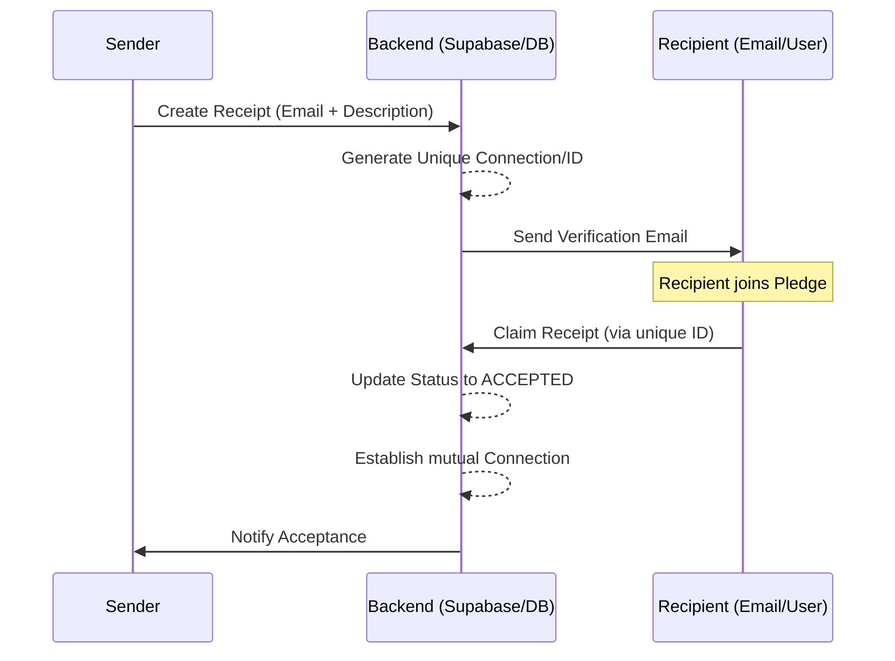
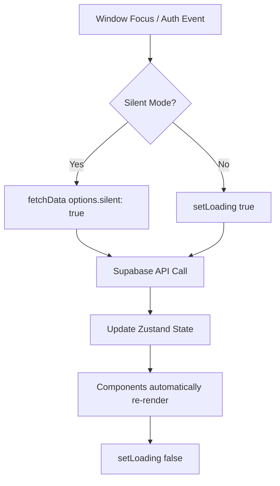

# Pledge Technical Specification

This document provides a comprehensive technical breakdown of the Pledge platform, including architecture, data flows, and system patterns.

---

## 1. System Architecture

Pledge is built as a **Serverless-First Web Application** using a modern reactive stack.

- **Frontend**: Single Page Application (SPA) built with React and Vite.
- **Backend-as-a-Service (BaaS)**: Supabase (Auth, PostgreSQL, Storage, Edge Functions).
- **AI Layer**: Gemini 1.5 Flash for semantic reputation analysis.
- **Visualization**: D3.js for force-directed network graph rendering.

---

## 2. Directory Structure

The project follows a feature-based organization.

```text
src/
├── app/            # Application core (Router, Auth Providers, Layout)
├── components/     # Shared UI components (GraphCanvas, Drawer, etc.)
├── services/       # External service adapters (Supabase, Gemini, Global Store)
├── views/          # Page-level views organized by feature
│   ├── Home/       # Main network dashboard
│   ├── Receipts/   # Proof creation, claim, and ledger views
│   ├── Profile/    # Trust Portfolio & CV views
│   ├── Auth/       # Login, Signup, Onboarding
│   └── Connections/# Network management
├── types.ts        # Centralized TypeScript definitions
├── utils/          # Pure helper functions (Export, Formatting)
└── constants.ts    # Centralized configuration and static data
```

---

## 3. Data Models

### 3.1. Database Schema (PostgreSQL)

| Table | Purpose | Key Columns |
| :--- | :--- | :--- |
| `public_profiles` | User identity & reputation meta | `user_id`, `email`, `first_name`, `institution` |
| `connections` | Professional graph edges | `low_id`, `high_id`, `accepted`, `requested_by` |
| `receipts` | Interaction proofs (nodes) | `from_user_id`, `to_user_id`, `description`, `tags`, `is_public`, `status` |

### 3.2. Core TypeScript Interfaces

```typescript
export type ReceiptStatus = 'AWAITING_SIGNUP' | 'AWAITING_CONNECTION' | 'ACCEPTED' | 'REJECTED';

export interface Receipt {
    id: string;
    from_user_id: string;
    to_user_id: string | null;
    recipient_email: string;
    status: ReceiptStatus;
    tags: string[];
    description: string | null;
    is_public: boolean;
    created_at: string;
}

export interface GraphNode {
    id: string;
    label: string;
    isMe?: boolean;
    strength: number;
    statusMix: { verified: number; pending: number; unclear: number };
    interactionStats?: { sent: number; received: number };
}
```

---

## 4. Data Flows

### 4.1. Receipt Lifecycle (Proof Creation & Claim)



### 4.2. Global State & Silent Fetching



---

## 5. Key Technical Patterns

### 5.1. Adaptive Theming (Dark Mode)
The application implements a custom design system using CSS variables controlled by a `ThemeProvider`.
- **Theme Injection**: The `ThemeProvider` injects variables into `:root` or a `data-theme` attribute.
- **Tailwind Integration**: Seamless switching between themes via Tailwind's `dark:` modifier.
- **Persistence**: User theme preference is persisted in `localStorage`.

### 5.2. The Trust Graph (D3.js)
The graph uses a force-directed simulation to represent relationship density. 
- **Memoization**: `GraphCanvas` uses `React.memo` to prevent expensive re-renders.
- **Conditional Links**: Link colors are computed dynamically based on the presence of pending receipts between nodes.
- **Physics Persistence**: Node physics states are preserved across data updates using reference mapping.

### 5.3. AI CAR Engine (Gemini)
The AI engine transforms raw unstructured text into structured professional highlights.
- **Service**: `aiService.ts`
- **Pattern**: Asynchronous batch processing on the client-side to mitigate rate limits and ensure a progressive loading experience in CV mode.

### 5.3. Relationship Deduplication
Connections are stored using a `low_id`/`high_id` pair (where `low_id < high_id`) to ensure only one record exists per pair of individuals, regardless of who initiated the first contact.

---

## 6. Infrastructure & Deployment

- **Environment Config**: Managed via `.env` (VITE_ prefixed for client access).
- **Communication**: Supabase PostgREST for standard CRUD, RPC for complex transactions (like claiming a receipt).
- **Exports**: `exportUtils.ts` handles client-side Blob generation for CSV downloads.

---
| **END OF TECHNICAL SPECIFICATION** |
